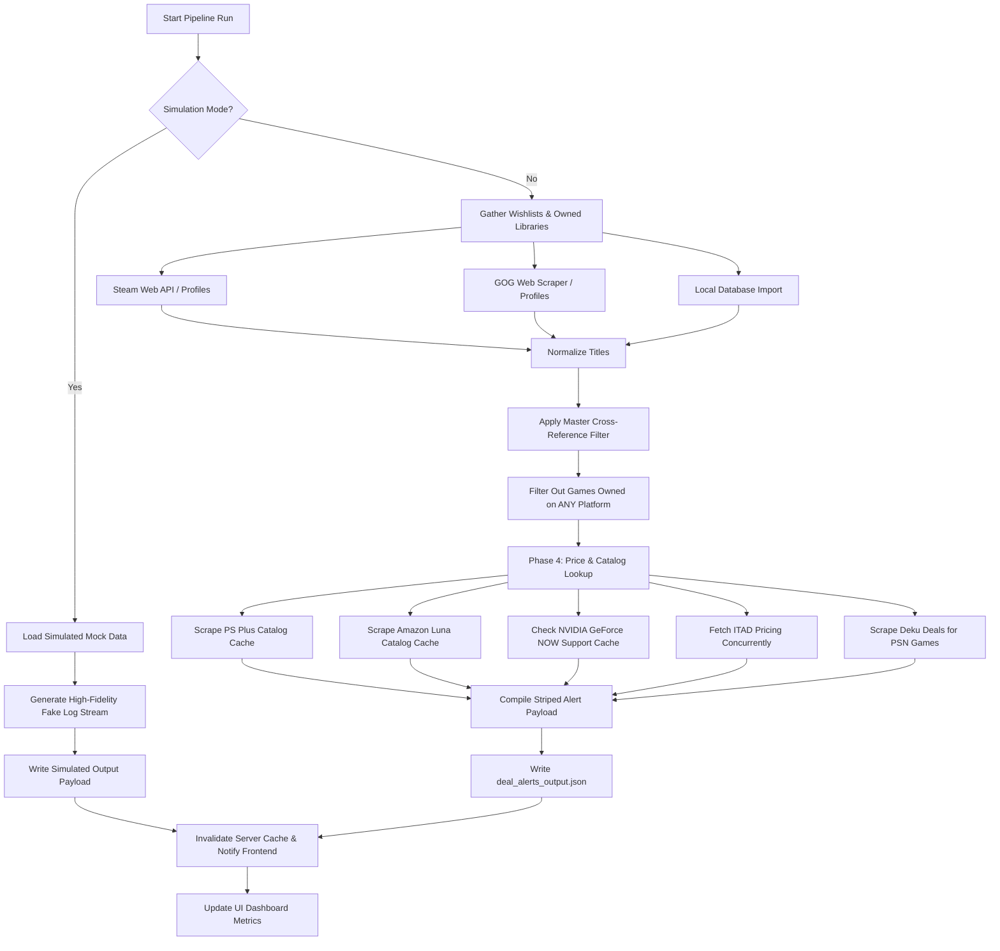

# Antigravity Wishlist Deal Tracker V2

An advanced, responsive, self-hosted web dashboard designed to aggregate gaming wishlists from **Steam**, **GOG**, and **PlayStation Network (PSN)**, filter out titles you already own elsewhere, check real-time pricing and active deals, and map game compatibility to subscription catalogs like **PlayStation Plus Premium**, **Amazon Luna**, and **NVIDIA GeForce NOW (GFN)**.

---

## Architecture Pipeline Flow

---

## Data Source Operations

Only **Steam Wishlist** and **GOG Wishlist** are dynamically requested/scraped from live web profiles at runtime. All other game lists (including Steam owned library, GOG owned library, PSN wishlist/owned library, and subscription catalog indices) utilize offline database cache files seeded weekly or imported manually.

| Data Source | How it is Pulled / Fetched | Cache Frequency / Mechanism |
| :--- | :--- | :--- |
| **Steam Wishlist** | Scraped from the public wishlist profile JSON endpoint at runtime. | **Live at Runtime:** Fetches directly at runtime. Falls back to `steam_cache.json` if rate-limited. |
| **GOG Wishlist** | Scraped from the public user wishlist endpoints at runtime. | **Live at Runtime:** Fetches directly. Falls back to `gog_cache.json` if network fails. |
| **Steam Owned Library** | Retrieved from the local `steam_cache.json` offline database. | **Manually/Weekly Cached:** Pre-loaded via profile scraper or import tab to prevent runtime delay/throttling. |
| **GOG Owned Library** | Retrieved from the local `gog_cache.json` offline database. | **Manually/Weekly Cached:** Pre-loaded via profile scraper or import tab to prevent runtime delay/throttling. |
| **PlayStation Network (PSN)** | PlayStation wishlists and owned libraries are imported manually via the copy-paste bulk importer. | **Manually Cached:** Saved locally inside `playstation_cache.json` (avoids Sony's aggressive cloud IP blocks). |
| **Deku Deals Scraper** | Scrapes PlayStation Store prices and active sales from Deku Deals. Run strictly for games with a `"PSN"` wishlist source. | **Live at Runtime:** Fetches PlayStation Store pricing dynamically during execution. |
| **IsThereAnyDeal (ITAD) API** | Queries IsThereAnyDeal API v2. First resolves title to internal ITAD UUIDs, then retrieves current shop prices. | **Live at Runtime:** Fetches prices in parallel during execution. |
| **PlayStation Plus / Amazon Luna / GFN** | Fetched using sitemaps, CDNs, and catalog scraping utilities. | **Cached Weekly:** Loaded from offline databases `ps_plus_catalog.json`, `amazon_luna_catalog.json`, and `gfn_catalog.json` to prevent runtime delays. |

---

## Security Features

1. **Local environment variables (`.env`)** are modified using atomic temp-file write-and-rename procedures to prevent data corruption.
2. **Secrets Masking:** Sensitive credentials (like Steam API Keys or ITAD Keys) are fully masked in the UI and returned as masked blobs (`••••••••`) from the server.
3. **Autofill Bypass Security:** Sensitive input elements utilize custom `-webkit-text-security: disc` CSS styling on plain `type="text"` fields. This displays secure bullet points while completely blocking Chrome and Windows credential managers from prompting to save passwords.
4. **Local Host Binding:** The Express server listens exclusively on local interfaces by default to prevent external access.

---

## Fixes & Optimizations by Antigravity

* **Multi-threaded Pricing Queries:** Integrated `concurrent.futures.ThreadPoolExecutor` into the Python agent. The 160+ sequential pricing queries now run concurrently, decreasing Live API pipeline execution time from **3 minutes** to **26 seconds**.
* **Chrome Password Manager Bypass:** Converted secrets form fields from `<input type="password">` inside a `<form>` to plain `<input type="text">` elements styled with Webkit text security masking. This retains UI security while completely stopping Chrome/Windows from prompting users to save passwords on submit.
* **Unbuffered Console Logs:** Configured `PYTHONUNBUFFERED: '1'` env settings on the spawned process. This ensures logs flush to the disk file immediately and stream line-by-line to the UI terminal console in real-time.
* **Vite Hot-Reload Exclusion:** Configured server watch ignores in `vite.config.ts` for log outputs and database cache files. This stops Vite from triggering browser page reloads and resetting React states when the pipeline finishes.
* **Targeted PlayStation Scraping:** Optimized the PlayStation deal scraper to run strictly when `"PSN"` is one of the wishlist sources for the game, eliminating over 140 unnecessary external scrapings.
* **Process Conflict Safety:** The server kills any running child process cleanly using `SIGTERM` before spawning a new thread, preventing double-trigger port/file conflicts.
